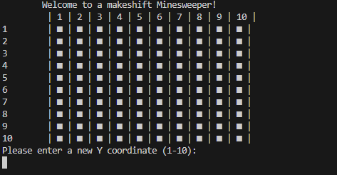
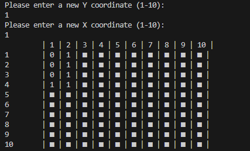
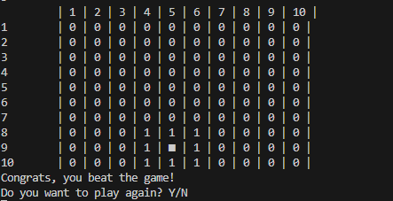

# Java Minesweeper in Command-line

## Demo & Snippets

### Game Start:

### User Guess:

### Hit bomb:

### Game won:

## Requirements / Purpose

- Recreate a simplified version of the game Minesweeper to be played in the java console
- The game should be able to randomly generate 10 mines in a 10x10 grid
- The user will be able to enter a command that represents a coordinate to check a location for a mine
- The application will display a number from 0-8 depending on how many mines surround that location
- If the user selects a mine, the game will respond "boom!" and the game will be lost
- If every non-mine square has been revealed, the game is won.
- Render the grid to the console after every user command

### Bonuses (optional)

- Allow for the user to configure number of mines and grid size via a configuration.json file (Difficult)
- Discovering an empty square should reveal all squares around it, and cascade into other nearby empty squares

### Purpose:

The purpose of this project was to make a working Minesweeper game that can be played using command-line inputs.

### Stack used:

- Java

---

## Build Steps

### Visual Studio Code:

1. In Main, click run (may need Java extensions)

### Eclipse:

1. Import project
2. Run Main

---

## Design Goals / Approach

### Design Goals

- As this game is emulating minesweeper, I used very similar design goals. A map is always presented to the user, which the user can choose the X/Y axis for a guess. This is then used to update the map, which is relayed to the user. If the user wins, a congratulations is posted. If the user hits a bomb, the user is told this. Both winning and losing gives the option to replay.
-

### Why?

- Since this app is solely to recreate minesweeper in Java command-line, I tried my best to implement as many design options from the core game into command line.

---

## Features

- User can guess a 10x10 grid's coordinate
- Map updates with user guess, and visually refreshes for the user
- If a bomb is hit, game ends
- If game is won, a message is displayed
- Game has a replay option
- Cascading coordinates - if an adjacent square is empty around the guessed square, reveal it until a number is found.

---

## Known issues

- Currently, user can't change any settings in game

---

## Future Goals

- I would like to allow the user to change the grid size, or number of bombs. This can either be based on difficulty, like the actual game, or changeable values.
- Refactor the code into different classes
- Potentially change logic of code to use the tiles as an object which stores bombs around it, if guessed and if bomb.
- I would also like to add a timer that is shown when the game ends, either by winning or hitting a bomb.

## Change logs

### 15/10/2023 - Logic fixes

- Fixed winning game logic to actually end when no bombs are remaining
- Fixed logic for user guesses, wasn't properly specifying if less than the grid size.

### 21/11/2023 - Displays hidden grid when game lost

- Changed setVisibleFromGuess to display the hidden grid when user hits a bomb, so they can see where the bombs were.

---

## What did you struggle with?

- I struggled at first breaking down the project. A lot of different thoughts were started, but not many were developed. One that stuck to me is the current implementation, which has a hidden and a visible grid. The hidden is generated at first, and the visible is what the user updates/see's. The visible checks the hidden grid to see what values are there, which was something that I had thought up before properly developing the project.
- After getting the logic behind generating the grids, the problems were much smaller and it was just logic fixes. The next main thing I struggled with was checking the adjacent squares for bombs, adding that number to the square. At first, I wasn't using a try/catch and the error was running rampant. After a review with a coach, they said since the program wasn't running hundreds of thousands of times, I could use a try/catch as the loss in speed would be negligible and it would instantly fix the issue.
- Cascading was very interesting getting started, and I tried a few different implementations without doing too much research. None of those worked, so a bit more research was done and I quickly fixed a previous implementation to work.

---

## Further details

- If you want to play the original game, you can go to this website: https://minesweeperonline.com
